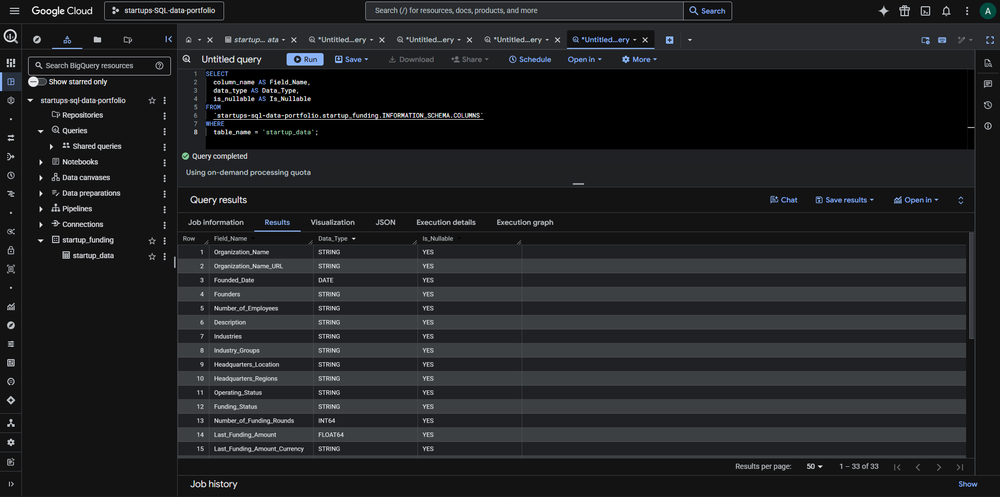
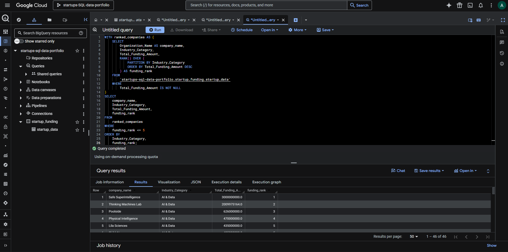

# Startup Funding Analysis (2024–2025)

An end-to-end data analysis portfolio project covering ETL, data cleaning, exploratory data analysis (EDA), and interactive data visualization using a Crunchbase startup dataset.

## 📊 Interactive Dashboard

**[View Tableau Dashboard →](https://public.tableau.com/app/profile/shengmin.hung/viz/StartupFundingAnalysis_17771540311390/StartupFundingAnalysis20242025)**


---

## Project Overview

**Dataset:** Crunchbase startup data — 1,576 companies, 32 columns  
**Scope:** Funding activity in 2024 and 2025 only  
**Goal:** Identify trends in startup funding across industries, geographies, and time periods

---

## Tech Stack

| Tool | Purpose |
|---|---|
| Python / pandas | ETL, data cleaning, preprocessing, exploratory data analysis |
| Google Colab | Notebook-based analysis environment |
| BigQuery | Cloud SQL analysis layer |
| SQL | Funding, geography, industry, and hiring-signal analysis |
| Tableau Public | Interactive dashboard and visual storytelling |
| GitHub | Version control and portfolio documentation |

---

## Project Structure

```text
startup_funding_analysis/
├── README.md
├── data/
│   ├── raw/
│   │   └── Startup_Data__Startup.csv
│   └── processed/
│       └── startup_funding_cleaned.csv
├── notebooks/
│   └── startup_funding_analysis.ipynb
├── sql/
│   └── startup_analysis_queries.sql
├── outputs/
│   └── sql_results/
│       ├── funding_by_industry.csv
│       ├── funding_by_region.csv
│       ├── funding_by_year.csv
│       ├── active_hiring_rate_by_industry.csv
│       ├── high_trend_low_funding_companies.csv
│       └── industry_funding_rank.csv
├── docs/
│   └── bigquery_schema.md
└── images/
    ├── bigquery_table_schema.png
    └── bigquery_query_example.png
```

---

## SQL Analysis (BigQuery)

Six business queries were written in BigQuery Standard SQL to support 
dashboard development and EDA findings:

| Query | Business Question |
|---|---|
| Funding by Industry | Which industries attract the most capital? |
| Funding by Region | Where are high-value startups concentrated? |
| YoY Trend | How did deal size and volume shift from 2024 to 2025? |
| Active Hiring Rate | Which industries show strongest hiring signals? |
| High-Trend / Low-Funding | Which smaller startups have rising momentum? |
| Industry Funding Rank | Top 5 funded companies per industry (window function) |

→ [View SQL queries](sql/startup_analysis_queries.sql)

---

## Key Findings from Python and Tableau Analysis

### Industry Funding
- **AI & Data dominates** with 676 startups and $17.2B total funding, but median deal size is only $4.7M — a few mega-deals drive the average
- **CleanTech & Energy** has the highest median deal size at $19.9M despite only 41 companies — most capital-efficient sector
- **E-Commerce & Retail** is the weakest performer with a $1.1M median deal size

### Geography
- **West Coast** leads with 530 startups and $17.5B total funding
- **Silicon Valley** alone accounts for 175 startups and $8.2B — a dense high-value cluster
- **New England** has the highest median deal size ($10M) driven by Boston biotech

### 2024 → 2025 Trends
| Metric | 2024 | 2025 | Change |
|---|---|---|---|
| Deal Count | 822 | 1,005 | +22% |
| Total Funding | $17.2B | $30.8B | +79% |
| Median Deal Size | $2.5M | $6.0M | +139% |

- Deal sizes are growing **much faster** than deal volume — 2025 is a year of larger, more concentrated bets
- **AI & Data** median nearly doubled: $3.25M → $6.3M
- **CleanTech** median nearly tripled: $12.25M → $34.65M
- **Media & Marketing** collapsed: $1.19B → $83M total funding

---

## Data Cleaning Highlights

- Converted date columns from `object` to `datetime64`
- Converted funding amount columns from `object` to `float64`
- Extracted `Founded_Year` and `Last_Funding_Year` from date columns
- Split `Headquarters_Regions` into `Region_Local`, `Region_Mid`, `Region_Broad`
- Extracted `State` from `Headquarters_Location` for geographic mapping
- Created `Industry_Category` column with 9 standardized categories
- Filtered out records with missing funding amounts (251 records)

---

## BigQuery SQL Analysis Layer

To strengthen this project beyond Python-based cleaning and Tableau visualization, I loaded the cleaned startup funding dataset into BigQuery and created a SQL analysis layer using BigQuery Standard SQL.

The SQL analysis answers business questions related to startup funding concentration, regional startup activity, year-over-year funding trends, active hiring signals, and company-level opportunity prioritization.

**SQL Engine:** BigQuery Standard SQL  
**Project:** `startups-sql-data-portfolio`  
**Dataset:** `startup_funding`  
**Table:** `startup_data`  
**Rows Analyzed:** 1,576  
**SQL File:** `sql/startup_analysis_queries.sql`  
**Query Outputs:** `outputs/sql_results/`  
**Schema:** `docs/bigquery_schema.md`

### Business Questions Answered

1. Which industries receive the most total and average funding?
2. Which regions have the highest startup concentration and funding activity?
3. How did funding activity change between 2024 and 2025?
4. Which industries show the highest active hiring rate?
5. Which lower-funded companies show strong recent trend signals?
6. Which companies rank highest in funding within each industry?

### SQL Outputs

| Query | Output File | Purpose |
|---|---|---|
| Funding by industry | `funding_by_industry.csv` | Identify industries with the highest funding concentration |
| Funding by region | `funding_by_region.csv` | Compare startup density and funding by location |
| Funding by year | `funding_by_year.csv` | Compare funding activity between 2024 and 2025 |
| Active hiring rate by industry | `active_hiring_rate_by_industry.csv` | Identify industries with stronger hiring signals |
| High trend / low funding companies | `high_trend_low_funding_companies.csv` | Find potentially under-the-radar companies |
| Industry funding rank | `industry_funding_rank.csv` | Rank top-funded companies within each industry using a window function |

### BigQuery SQL Findings

- `AI & Data` had the largest company count and total funding in the BigQuery analysis layer, with 599 companies and approximately $17.2B in total funding.
- `California` had the highest startup concentration by state, with 583 companies and approximately $25.0B in total funding.
- Within the analyzed dataset, total funding increased from approximately $17.2B in 2024 to $30.8B in 2025, a 78.8% increase.
- Average deal size increased from approximately $25.1M in 2024 to $34.6M in 2025.
- `CleanTech & Energy` showed the highest active hiring rate at 63.64%, though the sample size was smaller with 33 companies.

### BigQuery Evidence

Screenshots are included in the `images/` folder:

- `images/bigquery_table_schema.png`
- `images/bigquery_query_example.png`





---

## Dashboard Features

1. **Industry Funding Overview** — Total funding by industry (log scale bar chart)
2. **Geographic Map** — Startup concentration and funding by US state (filled map)
3. **2024 vs 2025 Comparison** — Median deal size growth by industry (side-by-side bar chart)
4. **Funding Distribution** — Spread and outliers by industry (box plot)

---

## Limitations

- This project uses a cleaned Crunchbase-style dataset and should not be treated as a complete representation of the startup market.
- Funding and hiring-related findings are limited to the records available in the analyzed 2024-2025 dataset.
- `Active_Hiring` and trend scores are treated as directional signals, not confirmed hiring outcomes.
- Tableau findings and BigQuery SQL findings may use different aggregation levels, such as broad region versus state-level grouping.
- The project is designed for exploratory business analysis and portfolio demonstration, not production forecasting.
